## CI/CDで構築するサーバーレスチャットアプリ


---

# 概要

このポートフォリオは、**Terraform** によるAWSインフラ構築を **GitHub Actions** によるCI/CDパイプラインから実行することで、ファイルをプルリクエストすれば自動でテストを行い、マージするだけでAWSインフラで動くサーバーレスな全体チャットアプリを自動で構築する学習成果物です。

## 使い方・ワークフロー

プルリクエストすることでterraform testとplanを実行、マージすることで自動デプロイを実行し、アプリケーションが起動します。<br>
CloudFrontディストリビューションをブラウザからアクセスし、メールアドレスを入力することで新規登録すると、認証用メールがアドレスに送信されます。<br>
書かれている認証コードを入力することで登録が完了し、個別のニックネームを設定することでリアルタイムチャットを楽しむことができます。<br>
今回構成するワークフローは以下の通りです。

1\. `backend/**`、`frontend/**`、`infra/**`ファイルや`.github/workflows/*.yaml`ファイルの変更をGitHubにプッシュ。

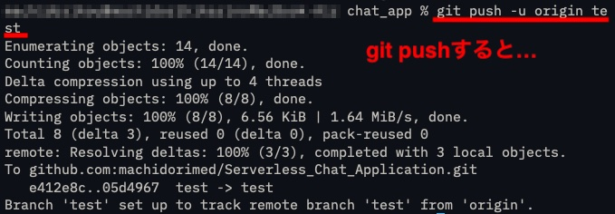

2\. GitHubのmainブランチにプルリクエストを送ると自動で **terraform plan** を実行。

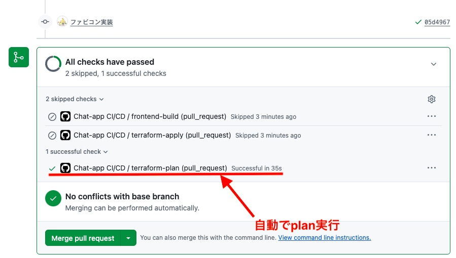

3\. mainブランチにマージすることで自動で **terraform apply** と **frontend build** を実行し環境を構築。

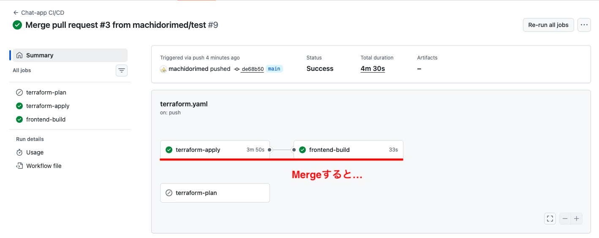

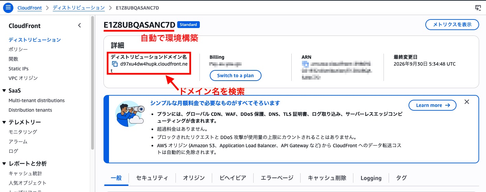

4\. ブラウザ上で `https://< CloudFrontドメイン名 >`にアクセスしアプリケーションの起動確認。

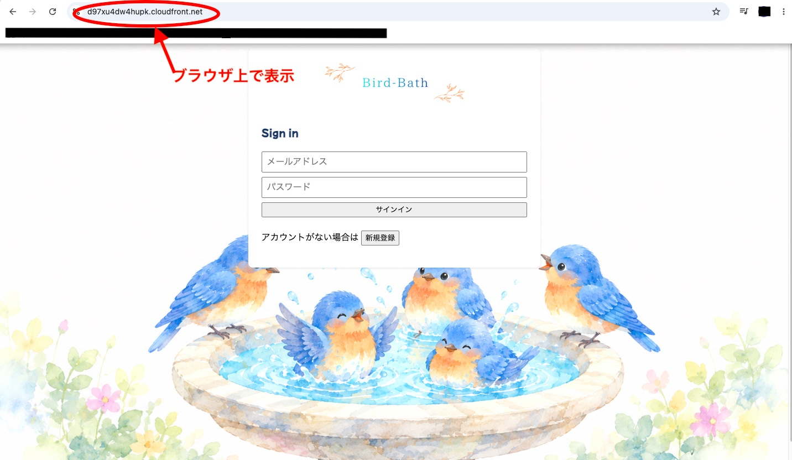

5\. 新規登録画面からメールアドレスを入力すると、確認コードを記載したメールが送られるので、コードをコピー。

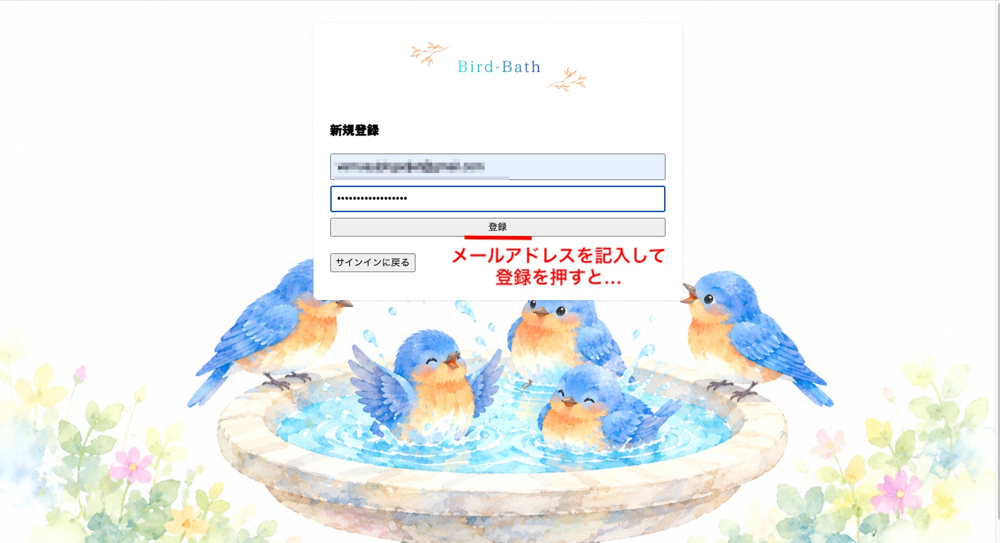

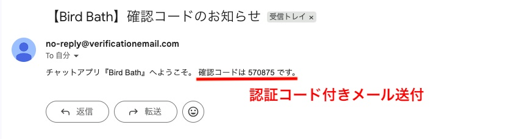

6\. 確認コードを入力すると新規等力完了。ニックネームを設定するとチャットを起動できます。

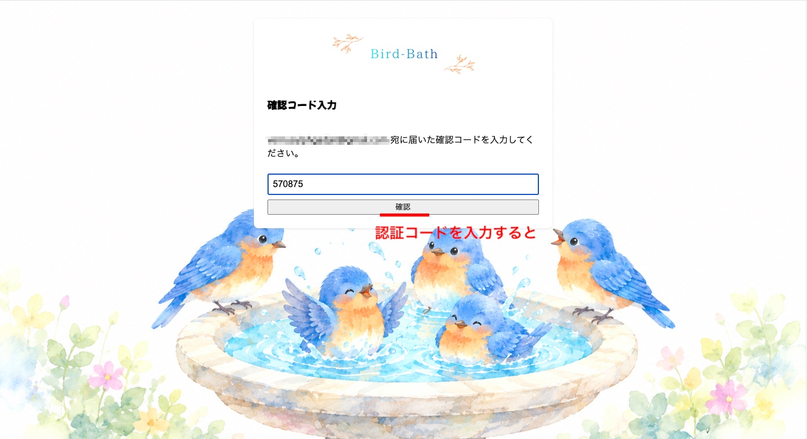

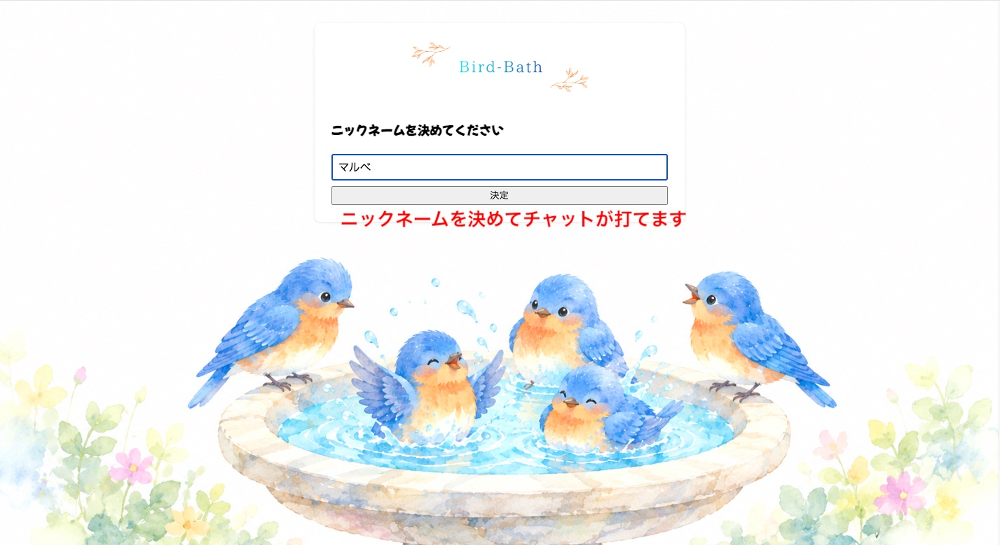

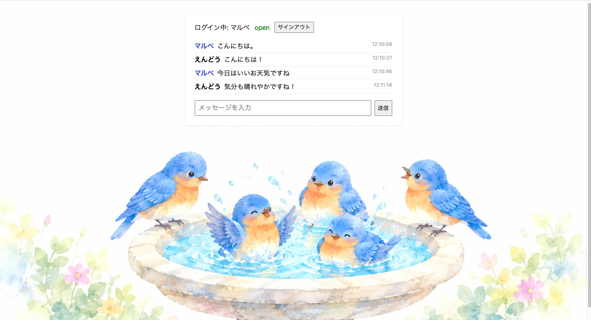

## 技術選定

**インフラプロビジョニング（IaC）**

- Terraformを採用
    - インフラ構成をコード化することで再現性と変更管理を担保するため
    - AWS CDKも検討したが、まだ慣れておらず新しいサービスを実装する上で使い慣れたTerraformを選択

**デプロイ（CI/CD）**

- GitHub Actionsを採用
    - GitHubとシームレスに連携でき、pushをトリガーに自動デプロイを実現できるため
    - 外部ツールを使わずシンプルな構成でCI/CDを構築できるため

## インフラ構成図

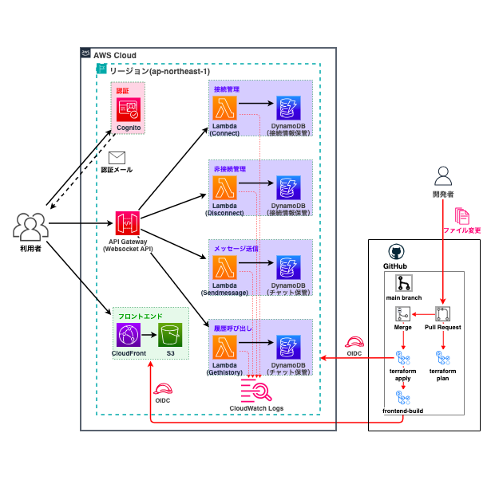

---

## 全体構成

**リージョン**

- **東京リージョン (ap-northeast-1)** を使用。

**Amazon CloudFront**

- フロントエンドに使用。 **Origin Access Control** を設定し、CloudFront経由のみS3バケット内のファイル配信を許可。

| 項目               |                           設定値                            |
| :----------------- | :---------------------------------------------------------: |
| 関連付けるS3       |                  `chat-app-frontend-****`                   |
| 接続ルール         | `Origin Access Control`（パブリックアクセスは全てブロック） |
| プロトコルポリシー |           `redirect-to-https`（HTTPS接続を強制）            |
| 価格クラス         |                    北米/欧州/アジアのみ                     |

**Amazon S3**

| 項目               |            設定値            |
| :----------------- | :--------------------------: |
| 名前               |   `chat-app-frontend-****`   |
| 認証               |  ブロックパブリックアクセス  |
| 暗号化             |        有効（SSE-S3）        |
| S3バケットポリシー | CloudFrontの読み取りのみ許可 |

**Amazon Cognito**

- 認証に使用。 **メールアドレス ＋ パスワード ＋ 認証コード** を設定し、登録・接続後にアプリ使用可能。

| 項目           |                設定値                 |
| :------------- | :-----------------------------------: |
| 名前           |         `chat-app-user-pool`          |
| ログインID     |            メールアドレス             |
| 認証方式       |    SRP(Secure Remote Password)方式    |
| パスワード設定 | 8文字以上かつ大文字小文字数字１字以上 |
| チャット表示名 |             ニックネーム              |

**Amazon API gateway**

- リアルタイムチャットを設定するため **Websocket API** を使用。
- 4つのLambda関数に接続する$connect、$disconnect、sendMessage、getHistoryと、未知のactionを受けた場合にsendMessage用のLambdaを流用する$defaultの５ルートを設定。

| 項目                                 |          設定値          |
| :----------------------------------- | :----------------------: |
| 名前                                 | `chat-app-websocket-api` |
| タイプ                               |     `Websocket API`      |
| スロットリング設定                   |           有効           |
| アクセス集中を許容する上限           |         50　(件)         |
| 定常的に処理できるリクエスト数の上限 |       100 (req/秒)       |
| ルート                               | $connect<br>$disconnect<br>sendMessage<br>getHistory<br>$default |

**AWS Lambda**

- バックエンドに使用。チャット機能を構成するconnect、disconnect、sendMessage、getHistoryの4つのLambda関数を設定。
- **connect**
    | 項目      |           設定値           |
    | :-------- | :------------------------: |
    | 名前      |     `chat-app-connect`     |
    | 実行環境  |        Node.js 20.x        |
    | 関数名    |        `connect.js`        |
    | IAMロール |  `chat-app-connect-role`   |
    | 役割      | ユーザーの接続の審査・登録 |
- **disconnect**
    | 項目      |           設定値           |
    | :-------- | :------------------------: |
    | 名前      |   `chat-app-disconnect`    |
    | 実行環境  |        Node.js 20.x        |
    | 関数名    |      `disconnect.js`       |
    | IAMロール | `chat-app-disconnect-role` |
    | 役割      |    ユーザーの切断の記録    |
- **sendMessage**
    | 項目      |              設定値              |
    | :-------- | :------------------------------: |
    | 名前      |     `chat-app-send-message`      |
    | 実行環境  |           Node.js 20.x           |
    | 関数名    |         `sendMessage.js`         |
    | IAMロール |   `chat-app-send-message-role`   |
    | 役割      | チャットの送信・保存・配信・掃除 |
- **getHistory**
    | 項目      |           設定値            |
    | :-------- | :-------------------------: |
    | 名前      |   `chat-app-get-history`    |
    | 実行環境  |        Node.js 20.x         |
    | 関数名    |       `getHistory.js`       |
    | IAMロール | `chat-app-get-history-role` |
    | 役割      |  チャット履歴の取得・返信   |

**Amazon DynamoDB**

- データベースに使用。ユーザーを保存するconnectionsテーブルとチャットを保存するmessagesテーブルを設定。
- **connectionsテーブル**
    | 項目                 |          設定値          |
    | :------------------- | :----------------------: |
    | 名前                 |  `chat-app-connections`  |
    | キャパシティモード   | オンデマンドキャパシティ |
    | サーバーサイド暗号化 |           有効           |
    | 役割                 | 接続中ユーザーの一時保存 |
    | TTL                  |      有効（3時間）       |
- **messagesテーブル**
    | 項目                 |          設定値          |
    | :------------------- | :----------------------: |
    | 名前                 |   `chat-app-messages`    |
    | キャパシティモード   | オンデマンドキャパシティ |
    | サーバーサイド暗号化 |           有効           |
    | 役割                 |    チャット内容を保存    |

**CloudWatch Logs・S3**

| 名称                                |   リソース名    |         説明          |
| :---------------------------------- | :-------------: | :-------------------: |
| `/aws/lambda/chat-app-connect`      | CloudWatch Logs |   Lambdaログ保管用    |
| `/aws/lambda/chat-app-disconnect`   | CloudWatch Logs |   Lambdaログ保管用    |
| `/aws/lambda/chat-app-send-message` | CloudWatch Logs |   Lambdaログ保管用    |
| `/aws/lambda/chat-app-get-history`  | CloudWatch Logs |   Lambdaログ保管用    |
| `aws-study-marube23-backet`         |       S3        | tfstateファイル保管用 |

**GitHub Secrets**

| 説明               |       変数       |                        値                         |
| :----------------- | :--------------: | :-----------------------------------------------: |
| OIDC用IAMロールARN | `"AWS_ROLE_ARN"` | arn:aws:iam::<AWSアカウントID>:role/<IAMロール名> |

---

### 開発環境

| 項目              |              説明              |
| :---------------- | :----------------------------: |
| インフラ構築(IaC) |        Terraform 1.14.7        |
| CI/CD             |         GitHub Actions         |
| コード管理        |             GitHub             |
| 使用端末          |        MacBook Air 2017        |
| 開発環境          | Zed / Git / Tarminal / AWS CLI |
| AIエージェント    |          Claude Code           |

## リポジトリ構成

```bash
.
├── .github/
│   ├── images/
│   └── workflows/
│       └── terraform.yaml          # CI/CD 実行ファイル
├── backend/
│   ├── package.json                # Lambda依存パッケージ定義
│   ├── package-lock.json
│   └── src/
│       ├── connect.js              # 接続の審査・登録
│       ├── disconnect.js           # 切断の記録
│       ├── getHistory.js           # チャット履歴の取得・返信
│       └── sendMessage.js          # 送信・保存・配信・掃除
├── frontend/                       # React(Vite)製フロントエンド
├── infra/
│   └── terraform/
│       ├── cognito.tf              # Cognito User Pool
│       ├── dynamodb.tf             # DynamoDB テーブル
│       ├── frontend.tf             # S3 + CloudFront
│       ├── lambda.tf               # Lambda関数
│       ├── main.tf                 # プロバイダー設定
│       ├── main.tftest.hcl         # テスト用ファイル
│       ├── outputs.tf              # 出力値定義
│       ├── variables.tf            # 変数定義
│       └── websocket_api.tf        # API Gateway WebSocket
├── .gitignore
└── README.md
```

---

## GitHub Actions 概要（terraform.yaml）

- 以下の3つのジョブで構成。

| ジョブ名            | トリガー                             | 内容                                                                                                                                                               |
| ------------------- | ------------------------------------ | ------------------------------------------------------------------------------------------------------------------------------------------------------------------ |
| **terraform-plan**  | プルリクエスト時                     | `backend`の依存インストール後、`terraform fmt` / `validate` / `test` / `plan` を実行(CI)。                                                                         |
| **terraform-apply** | mainブランチへのpush（＝PRマージ）時 | `terraform apply -auto-approve` でインフラを構築・更新(CD)。CloudFront・S3・Cognito・WebSocket APIの各出力値を取得。                                               |
| **frontend-build**  | `terraform-apply` 成功後             | `terraform-apply`の出力値を環境変数（`VITE_*`等）として受け取りフロントエンドをビルド。`aws s3 sync`でS3へアップロードし、CloudFrontのキャッシュを無効化して反映。 |

## 工夫した点

- **セキュリティ・認証方式**
    - GitHub ActionsにはOpenID Connect (OIDC)を設定。認証情報の漏洩リスクを低減し、セキュアな運用を実現。
    - 各Lambda関数に、共通ロールではなく個別の最小権限IAMロールを設定。関数ごとに本当に必要な操作だけを許可。

- **コスト最適化**
    - Lambdaで処理を行うサーバーレス構成。
    - DynamoDBはオンデマンド課金、CloudFrontは北米/欧州/アジア限定の価格クラス、CloudWatch Logsは保持期間7日、API Gatewayにはスロットリング上限を設定。
    - 管理の手間を削減し、コストを抑える工夫を随所に反映

---

## 課題と解決

**① チャット履歴非表示の不具合**

- **課題**
    - 当初`connect`関数に履歴配信の役割を与えていたが、再サインインしても、過去のメッセージ(直近10件)が画面に表示されない。
- **対応**
    - CloudWatch Logsで`connect`関数のログを確認したところ「Failed to send history ... UnknownError」というエラーを発見。
    - `$connect`の処理が完了するまでその接続を「確立済み」として扱わないため、`$connect`の中から自分自身にデータを送信できないという仕様上の制約が原因と判明。
    - 履歴配信を`getHistory`という別ルート・別Lambdaに分離し、クライアントが接続完了後(`onopen`後)にリクエストする方式へ設計変更。
- **結果**
    - 履歴配信が正常に動作することを確認。

**② サインアウト時の不具合**

- **課題**
    - WebSocketの切断時に`disconnect`関数が呼ばれないケースが発生すると、connectionsテーブルのレコードが消えない。
- **対応**
    - DynamoDBのconnectionsテーブルに3時間のTTLを設定。
    - `sendMessage`関数にも配信失敗時に削除する処理を追加。
- **結果**
    - 二重の対策により、異常切断時でも接続情報が確実に削除されるよう設定。

**③ ニックネーム重複時の不具合**

- **課題**
    - 2人のユーザーが同じニックネームを設定すると、相手の発言が自分の発言として(ハイライト色付きで)表示される不具合が発生。
- **対応**
    - 構成を確認し、「自分の発言かどうか」の判定に、重複しうる表示名(ニックネーム文字列)を使っていたことが原因と判明。
    - ユーザー判別をCognitoが発行する不変の一意なユーザーID(`sub`)での比較に変更。
- **結果**
    - ニックネームが重複しても、発言者を正しくハイライトできることを確認。

---

## 今後の改善点

- 複数チャットルームを実装し、ユーザーグループごとにチャットルームを用意する

- メール送信機能をAmazon Cognitoに依存しているが、想定するユーザーが増える場合はAmazon SESへ移行する

- URLを固定する場合はACM証明書 + Route53で独自ドメインを設定する

- 想定外のコスト発生に備えAWS Budgetsを設定する
